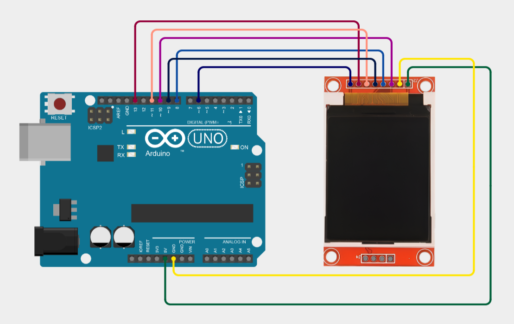

# Arduino Display Module (ST7735)

Small Arduino sketch that drives a **160×128 ST7735 TFT** using the Adafruit GFX/ST7735 libraries, showing:

- a **status bar** (WiFi/RTC + short time),
- a **main content area** (large centered text),
- a **footer** with simple labels,
- **serial-triggered wake** + **auto screen timeout** (backlight off).

Source: [arduino-display-module.ino](arduino-display-module.ino)

## Hardware

- Arduino-compatible board with SPI
- ST7735 160×128 TFT (configured as `INITR_BLACKTAB`)
- Backlight pin on a PWM-capable pin (this sketch uses D6)

### Pin mapping (as coded)

| Signal | Arduino pin | Macro |
| --- | ---: | --- |
| TFT CS | 10 | `PIN_TFT_CS` |
| TFT DC | 9 | `PIN_TFT_DC` |
| TFT RST | 8 | `PIN_TFT_RST` |
| TFT LED (backlight) | 6 | `PIN_TFT_LED` |

SPI pins (MOSI/SCK) come from your board’s hardware SPI.

## Libraries

Install these via Arduino Library Manager:

- **Adafruit GFX Library**
- **Adafruit ST7735 and ST7789 Library**
- **SPI** (usually built-in)

## What it does

- Draws UI sections:
  - Status bar: [`drawStatusBar`](arduino-display-module.ino)
  - Main content: [`drawMainContent`](arduino-display-module.ino) (also used for serial messages)
  - Footer: [`drawFooter`](arduino-display-module.ino)
- Centers text using [`drawCenteredText`](arduino-display-module.ino)
- Turns the backlight off after `DISPLAY_TIMEOUT_MS` via [`checkDisplayTimeout`](arduino-display-module.ino) and [`screenTimeout`](arduino-display-module.ino)
- Wakes the screen on serial input via [`wakeDisplay`](arduino-display-module.ino)

## Usage

1. Open [arduino-display-module.ino](arduino-display-module.ino) in Arduino IDE.
2. Select your board + port.
3. Upload.
4. Open **Serial Monitor** at **9600 baud**.
5. Send a line (ends with `\n`). The display will wake (if asleep) and show your message in the main area.

The sketch currently uses:

- Landscape mode: `tft.setRotation(3)`
- Backlight “on” level: `analogWrite(PIN_TFT_LED, 31)`
- Screen timeout: `DISPLAY_TIMEOUT_MS` (default 30 seconds)

## Customization

- Timeout: change `DISPLAY_TIMEOUT_MS` in [arduino-display-module.ino](arduino-display-module.ino)
- Colors: adjust `COLOR_BACKGROUND`, `COLOR_FOREGROUND`, `COLOR_ACCENT`, `COLOR_STATUSBAR`, `COLOR_FOOTER`
- Layout: tweak `STATUSBAR_HEIGHT`, `FOOTER_HEIGHT`, and derived constants (`CONTENT_Y`, `CONTENT_HEIGHT`)
- Backlight brightness: adjust the `analogWrite(PIN_TFT_LED, ...)` values inside [`setup`](arduino-display-module.ino), [`screenWake`](arduino-display-module.ino), and [`screenSleep`](arduino-display-module.ino)

## Notes / Limitations

- “WiFi/RTC” values and the short time in the status bar are currently hardcoded in [`setup`](arduino-display-module.ino).
- Serial input replaces the main content immediately (no command parsing yet).
